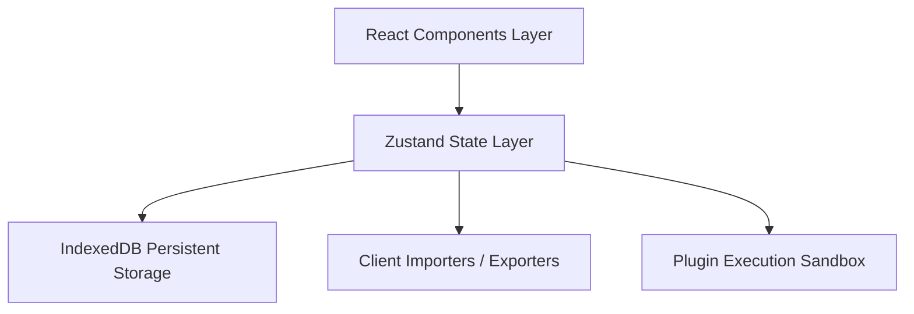

# Markdown Studio (Inkleaf) - Product Documentation

Welcome to the comprehensive technical documentation for the **Advanced Markdown Studio** (Inkleaf). This application is a fully browser-based, offline-first, high-fidelity markdown typesetting and editing environment.

---

## 1. System Architecture

Markdown Studio utilizes a modular **Feature-Based Clean Architecture** on top of Next.js 14 and React 18, utilizing the following layers:



### Architectural Decisions & Tradeoffs
1.  **Storage Engine (IndexedDB)**: We chose a native IndexedDB wrapper (`lib/db.ts`) over a cloud database or LocalStorage.
    *   *Tradeoff*: IndexedDB handles heavy version histories and file blobs (like images) with a 50MB+ quota, which LocalStorage (5MB cap) cannot support. It operates 100% client-side, giving the user complete ownership of their data.
2.  **CodeMirror 6 Editor**: The editing interface wraps CodeMirror 6 (`@uiw/react-codemirror`), avoiding native `<textarea>` inputs.
    *   *Tradeoff*: CodeMirror 6 offers enterprise features (syntax highlighting, line folding, active line indicators, search matching, bracket completion) with high virtual rendering performance for large documents, though it has a larger bundle footprint.
3.  **Client-side Exporters (Microsoft Word DOCX & PDF)**:
    *   *DOCX*: Generated using an Office-compliant OpenXML HTML wrapper which Word translates natively upon opening. This avoids downloading large client-side zip compilers.
    *   *PDF*: Handled via custom print layouts (`@media print` in `globals.css`). This removes the need for rendering canvases (like jsPDF) and creates crisp vector text.
4.  **Plugin Sandbox**:
    *   Uses a `new Function` compiler to process custom script bundles. While `eval`-adjacent, it operates strictly in the user's local thread on scripts they manually paste. We include warnings in the UI about untrusted scripts.

---

## 2. Directory Structure

```
markdown-studio/
├── app/
│   ├── globals.css         # CSS Variables Theme and Markdown manuscript styling
│   ├── layout.tsx          # Fonts loading and HTML shell configuration
│   ├── manifest.json       # PWA Application Settings
│   └── page.tsx            # Main layout orchestration & key listeners
├── components/
│   ├── layout/
│   │   ├── ResizablePanels.tsx  # Touch-friendly resizable split panels
│   │   ├── Sidebar.tsx          # Collapsible tree file-explorer
│   │   ├── StatusBar.tsx        # Statistical metrics & sync status
│   │   └── TopNav.tsx           # Tab bar & export dropdowns
│   └── ui/
│       └── CommandPalette.tsx   # Fuzzy action search popup
├── docs/
│   └── DOCUMENTATION.md    # Product documentation (This file)
├── features/
│   ├── editor/
│   │   └── components/
│   │       ├── FormattingToolbar.tsx # Markdown syntax inserter
│   │       └── MarkdownEditor.tsx    # CodeMirror 6 editor wrapper
│   ├── history/
│   │   └── components/
│   │       └── VersionHistory.tsx    # Auto-saved snapshots & Unified Diff
│   ├── plugins/
│   │   └── components/
│   │       └── PluginManager.tsx     # Extensibility manager & AI stubs
│   ├── search/
│   │   └── components/
│   │       └── SearchDialog.tsx      # Multi-note regex find & replace
│   └── themes/
│       └── components/
│           └── ThemeEditor.tsx       # Custom CSS variable customizer
├── lib/
│   ├── db.ts               # IDBDatabase IndexedDB wrapper
│   ├── exporters.ts        # Client download helpers
│   ├── importers.ts        # Client file loaders
│   └── utils.ts            # Class merging utility
├── public/
│   └── sw.js               # Service Worker for offline asset caching
├── stores/
│   ├── useEditorStore.ts   # Active CM6 EditorView state
│   ├── useFileStore.ts     # Workspace files and tabs state
│   ├── usePluginStore.ts   # AI providers and script plugins
│   ├── useSettingsStore.ts # Core preferences & sizing
│   └── useThemeStore.ts    # Theme CSS variable overrides
└── types/
    └── index.ts            # Core TypeScript model interfaces
```

---

## 3. Component Details & Design

### CodeMirror 6 Editor (`MarkdownEditor.tsx`)
Extends CodeMirror 6 with custom styles reacting to CSS theme variables:
*   **Focus Mode**: Applies `opacity: 0.25` and a slight blur filter on all lines that do not have the active `.cm-activeLine` class.
*   **Typewriter Mode**: Configures `EditorView.scrollMargins.of` dynamically to return half the viewport height, locking the cursor center-screen.

### Version History & Diff Engine (`VersionHistory.tsx`)
Retrieves snapshots from IndexedDB. It compares historical versions against current text by performing a line-by-line comparison:
*   Lines that exist in the snapshot but not in the active draft are marked as `removed` (red highlights with `-`).
*   Lines that exist in the active draft but not in the snapshot are marked as `added` (green highlights with `+`).

### Resizable Panels (`ResizablePanels.tsx`)
A pointer event tracker that handles layout transitions.
*   *Sidebar*: Adjusts width (in pixels) on pointer drag, constrained to `[180px, 450px]`.
*   *Split*: Adjusts the editor panel percentage split (`[15%, 85%]`), shrinking the preview pane.
*   *Resets*: Double-clicking either slider resets size variables to default presets (Sidebar: `260px`, Editor/Preview Split: `50%`).

---

## 4. Developer Extensibility

### Theme Variables Schema
Custom themes customize variables injected into `document.documentElement.style`:
```typescript
interface CustomThemeColors {
  bg: string;             // Main application workspace background
  text: string;           // Workspace default text
  sidebarBg: string;      // Sidebar backdrop
  sidebarText: string;    // Sidebar default text
  editorBg: string;       // CodeMirror editor backdrop
  editorText: string;     // CodeMirror text color
  editorCursor: string;   // CodeMirror caret
  paperBg: string;        // Preview panel parchment backdrop
  paperText: string;      // Preview typography text
  paperBorder: string;    // Preview divider lines
  accent: string;         // Primary indigo brand color
  gold: string;           // Manuscript headers gold divider lines
}
```

### Plugin Script Guide
Plugins are Javascript objects exported via standard `module.exports` syntax:
```javascript
module.exports = {
  // Runs before rendering markdown content
  onRender: function(text) {
    // Replace shortcuts with emojis
    return text.replace(/:check:/g, "✅");
  },
  // Runs before committing edits to IndexedDB
  onBeforeSave: function(text) {
    return text;
  }
};
```
To register a plugin, navigate to the **Extensions Manager**, click **Register Plugin**, input name/description, and paste your code block.

---

## 5. Security & Performance Notes

### Security Implementations
1.  **No Server Communications**: Everything operates offline in the browser sandboxed scope. API keys configured for Gemini or OpenAI are stored strictly in local memory and are sent directly to the official endpoints without hitting third-party nodes.
2.  **HTML Sanitization**: Custom renderers inside `ReactMarkdown` bypass raw script evaluations (`rehypeRaw` parses basic layout tags but rejects script injections).

### Performance Benchmarks
1.  **Virtual Rendering**: CodeMirror 6 renders only the visible lines in the viewport, maintaining a steady 60FPS editing interface even for 10,000+ line documents.
2.  **Debounced Database Writes**: File edits are saved to IndexedDB using a debounced timer (1000ms delay per file), minimizing disk writes and keeping the main UI thread lag-free.
3.  **Lazy Loading Diagrams**: Mermaid libraries are loaded dynamically only when a document containing a `mermaid` code block is rendered.
